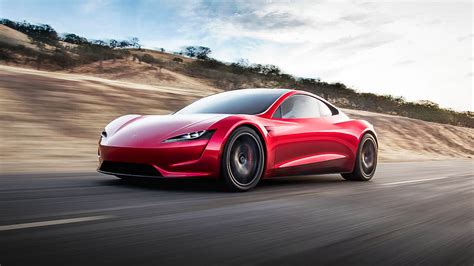

# How Can We Build the Most Fuel Efficient Car?

- I conducted linear regression inference on a dataset to determine the most fuel-efficient car design using Python and the Scikit-Learn library

- I processed a dataset containing 477,061 missing values for analysis using the Numpy and Pandas libraries in Python

- I used data visualization techniques and the matplotlib library to choose the best linear regression algorithm for the dataset to minimize overfitting

# Results
0. The most fuel efficient car would be an electric small station wagon with manual transmission and front wheel drive
1. The average fuel range of cars has increased by 9% from 1984 to 2020.
2. The percentage of alternative fuel vehicles(electric, bio-fuel and etcetera) increased by 12% from 1984 to 2020.
    - This is likely one of the reasons that fuel economy is increasing with time.
    - The increasing popularity of alternative fuel vehicles is surprising as it is quite drastic.
3. The government incentives and metrics included in this dataset  (green house gases score and gas guzzler tax) correlate with fuel efficiency so they are effective metrics to measure fuel efficiency.
    - The feScore, ghgScore and guzzler Tax should deter people from wasteful vehicles and encourage them to use efficient ones
4. Tesla is the manufacturer with the highest average fuel range.
